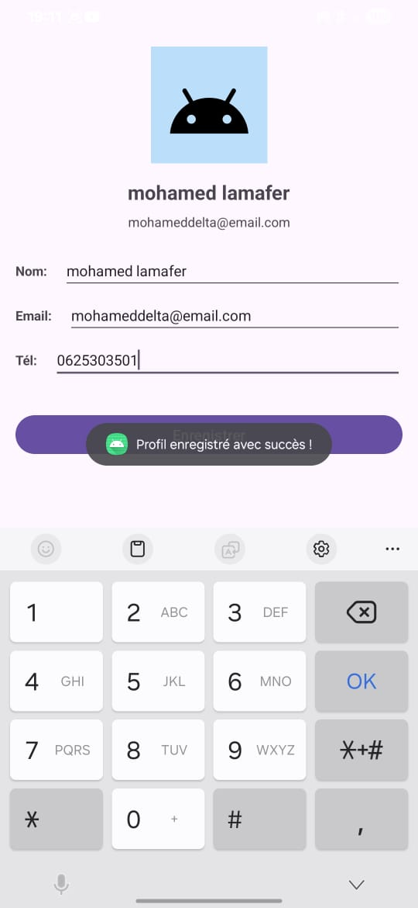

# 👤 Application Profil Utilisateur

## Étudiant
- **Nom :** Mohamed Lamafer  
- **Date :** 07/11/2025  

##  Description
Application qui affiche et modifie les informations d’un utilisateur (nom, email, téléphone).

##  Fonctionnalités
-  Interface avec **ConstraintLayout**
-  Édition et affichage des informations
-  Bouton pour sauvegarder les changements

##  Captures d'écran

##  Ce que j'ai appris
- Utiliser ConstraintLayout pour placer les éléments  
- Gérer les événements des boutons  
- Mettre à jour les TextView avec les valeurs saisies  

##  Difficultés rencontrées
- Problème de contraintes → résolu avec `app:layout_constraintStart_toStartOf="parent"`  
- Texte non mis à jour → corrigé avec `text = editText.text.toString()`
