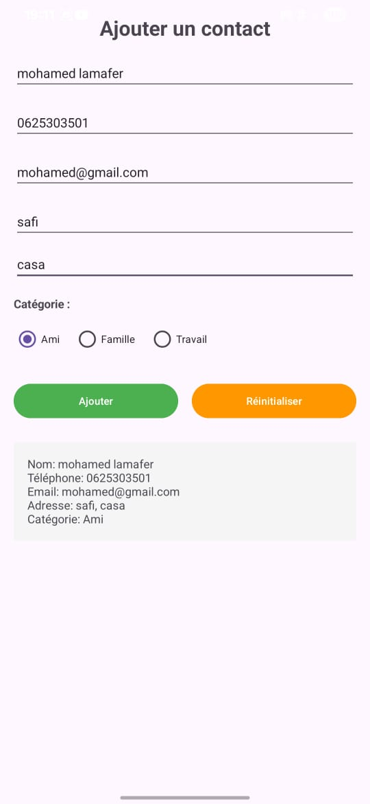

#  Application de Contact

## Étudiant
- **Nom :** Mohamed Lamafer  
- **Date :** 07/11/2025  

##  Description
Formulaire complet pour ajouter un contact avec :
- Nom
- Email
- Téléphone
- Catégorie (Personnel / Professionnel)
- Message

##  Fonctionnalités
-  Interface avec **ConstraintLayout**
-  RadioButtons pour les catégories
-  Validation complète des champs
-  Bouton de réinitialisation

##  Captures d'écran

##  Ce que j'ai appris
- Créer un formulaire complet sous Android  
- Gérer les RadioButtons et les validations  
- Utiliser `Toast` pour afficher des messages

##  Difficultés rencontrées
- RadioGroup ne fonctionnait pas → corrigé avec `checkedRadioButtonId`  
- Réinitialisation → faite avec `editText.setText("")`
